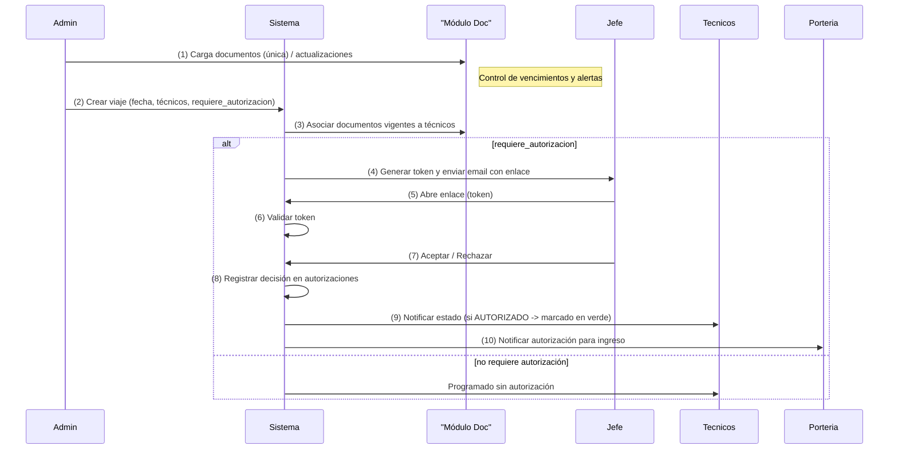
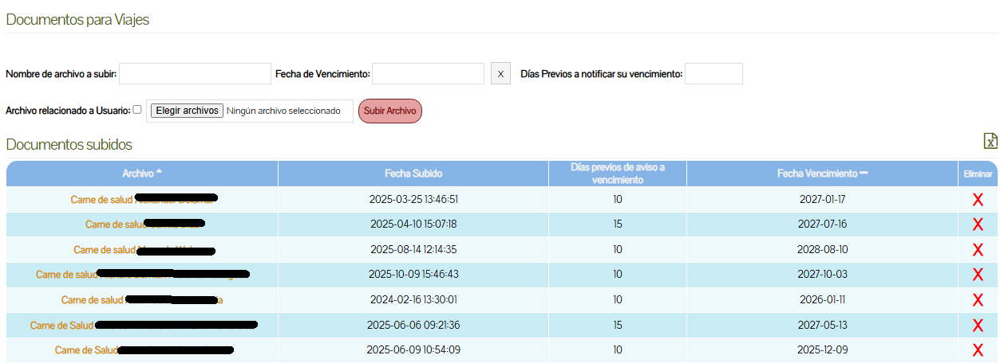
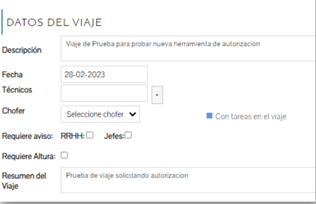
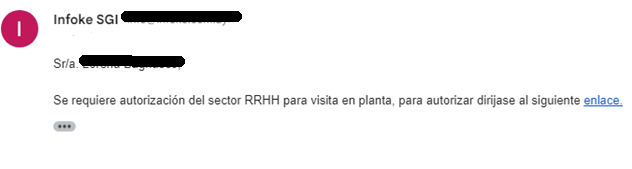
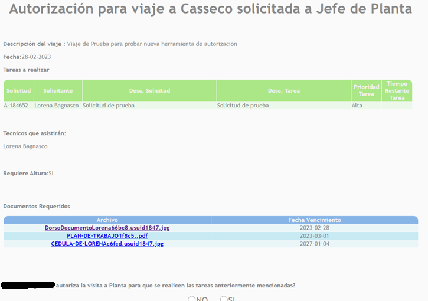
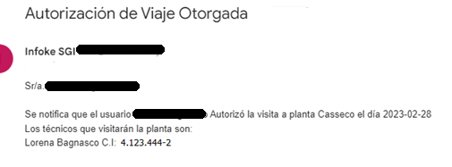

🏷️ Sistema de Solicitud de Autorización de Ingreso a Planta — One-Click Authorization

📝 Descripción 

Este sistema permite gestionar y agilizar el proceso de autorización de ingreso a plantas industriales sin necesidad de que los responsables deban loguearse en el sistema.
La solicitud se genera desde un módulo interno, se adjunta toda la documentación requerida y se envía un enlace único y encriptado a los Jefes de Planta del cliente, quienes pueden aprobar o rechazar en un solo clic.

El objetivo principal es reducir tiempos de gestión, eliminar fricciones y garantizar que cada planta reciba la información completa, validada y acompañada de los documentos necesarios para habilitar el ingreso de técnicos.

🎯 Motivación y problemática

Antes del desarrollo:

Los permisos de ingreso se gestionaban por correo electrónico, vía mensajes, o telefonicamente.

Los jefes de planta debían revisar manualmente la información, y muchas veces no las veían.

Los técnicos enviaban documentos dispersos (cédulas, permisos, libretas, BPS).

Había riesgo de perder información, adjuntar documentos desactualizados o equivocarse con el equipo asignado al viaje.

El proceso era lento, poco auditable y difícil de coordinar.

Este sistema surge para automatizar, centralizar y simplificar este flujo.

🎯  Objetivos del sistema

Generar solicitudes de autorización con información completa y validada.

Adjuntar automáticamente la documentación requerida para cada técnico.

Permitir autorizaciones rápidas, seguras y sin login.

Garantizar trazabilidad del proceso.

Reducir tiempos internos de coordinación entre áreas.

Mejorar la comunicación entre Infoke y las plantas del cliente.

Eliminar errores por envíos manuales o documentos incorrectos.

🔄 Funcionamiento general

Desde el sistema interno se crea un viaje.

Se seleccionan los técnicos asignados a la tarea.

El sistema busca y asocia automáticamente los documentos cargados previamente, por unica vez para cada técnico:

Permisos laborales de la empresa

Cédulas de los tecnicos

Libreta del vehículo

etc.

Se genera un enlace único para cada responsable, con su ID encriptado en la URL.

El jefe de planta recibe el enlace por e-mail.

Al ingresar, visualiza:

Fecha del viaje

Técnicos asignados

Tareas a realizar

Documentos adjuntos

Solo debe seleccionar Aceptar o Rechazar.

Su respuesta queda registrada automáticamente sin necesidad de loguearse.

El sistema actualiza el estado del viaje y notifica internamente.

⭐ Características principales

Autorización sin login (gracias al enlace seguro con ID encriptado).

Formulario ultra simplificado (Aceptar / Rechazar).

Adjunte automático de documentos según técnicos seleccionados.

Integración con otro módulo de carga documental.

Flujo claro entre Infoke y plantas del cliente.

Trazabilidad completa de cada autorización.

Reducción drástica de tiempo de revisión.

Acceso seguro, una sola acción resuelve todo.

🏛️ Arquitectura y componentes

Backend: PHP
Base de datos: MySQL
Frontend: HTML + CSS
Control de versiones: Git
Integración: módulo interno de viajes + módulo de carga documental

Componentes principales:

Módulo de creación de viajes

Asignación de técnicos y tareas

Generador de URL con ID encriptado

Formulario público autovalidable

Procesador de autorización

Actualización del estado en el sistema interno

Registro y auditoría

📥 Flujo detallado

Carga única de documentos (se gestionan caducidades).

Creación del viaje (se indica si requiere autorización).

Generación y envío de enlace “one-click” a los jefes de planta.

Jefe responde (Aceptar/Rechazar) desde el formulario sin logueo.

Sistema actualiza estado del viaje y notifica a técnicos y portería.

📸 Capturas del funcionamiento

A continuación se incluyen imágenes representativas del flujo completo de la herramienta de Autorización de Ingreso a Planta con un solo clic.
Cada captura ilustra un momento clave del proceso: carga documental, creación del viaje, notificación por correo, autorización por un clic y confirmación final.

1. Carga de archivos del viaje

Archivo: carga_archivos_viaje.png
Esta pantalla corresponde al módulo donde se visualizan y gestionan los documentos asociados a cada técnico.
Los archivos se cargan una sola vez, y el sistema controla sus fechas de vencimiento para que siempre estén disponibles al momento de generar una autorización.

2. Datos del viaje

Archivo: Datos_viaje.png
Vista donde se definen los detalles del viaje: fecha, planta, técnicos participantes y si requiere autorización de ingreso.
Al confirmar, el sistema genera automáticamente la solicitud para los jefes de planta si corresponde.

3. Correo de solicitud de autorización

Archivo: correo_autorizacion.png
Ejemplo del correo que recibe el jefe de planta.
Incluye un enlace único y seguro (token encriptado), que permite autorizar o rechazar sin necesidad de ingresar al sistema.

4. Formulario de Autorización (one-click)

Archivo: formulario_autorizacion.png
Al hacer clic en el enlace recibido, el jefe accede a este formulario minimalista.
Puede ver la información del viaje, los técnicos, tareas y todos los documentos adjuntos.
Desde aquí decide aprobar o rechazar con un solo clic.

5. Autorización otorgada

Archivo: autorizacion_otorgada.png
Una vez completado el proceso, se envían las notificaciones correspondientes a portería para habilitar el ingreso de los tecnicos.

🧩 10. Ejemplos de código

(Acá irán los bloques de código que vos me pases. Algunos que seguramente incluiremos:)

🔐 Generación de URL con ID encriptado
// Ejemplo a completar

📄 Lógica para adjuntar documentos según técnicos
// Ejemplo a completar

✔️ Procesamiento de la autorización (Aceptar / Rechazar)
// Ejemplo a completar

🗂️ Consulta principal a la BD
// Ejemplo a completar

🗄️ 11. Base de datos

Tablas involucradas (a completar):

viajes

viaje_tecnicos

autorizaciones

usuarios

documentos

documentos_tecnicos

Campos relevantes, relaciones y claves foráneas.

(Podemos armar diagrama ER si querés.)

🛠️ 12. Tecnologías utilizadas

PHP

MySQL

HTML

CSS

Git

Sistema interno de gestión de viajes (Infoke)

🚀 13. Instalación / configuración

(Opcional. Lo agregamos si querés que otros puedan montarlo local.)

👤 14. Autoría

Desarrollado por:
Lorena Bagnasco — Backend Developer (PHP)
GitHub: https://github.com/lorenabagnasco
